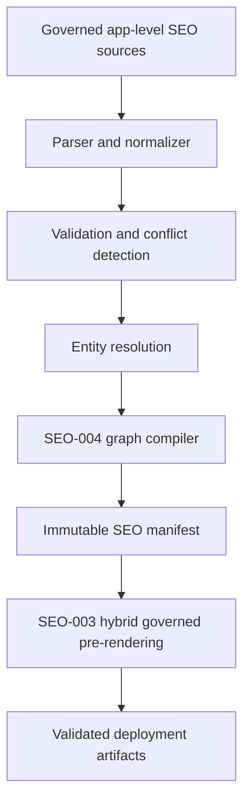

# Ansiversa AI SEO Compiler and Validation Pipeline

**Specification:** AI SEO Compiler and Validation Pipeline
**Specification Version:** 1
**Task:** SEO-005
**Status:** Approved
**Discovery:** Complete
**Specification:** Complete
**Architecture Direction:** Astra - Approved 2026-07-23
**Architecture Review:** Approved 2026-07-23
**Freeze:** Frozen 2026-07-23
**Product Owner Approval:** Karthikeyan Ramalingam - Approved 2026-07-23
**ADR:** Accepted
**Implementation:** Not authorized
**Production:** Unchanged
**Created:** 2026-07-23

This specification defines the governed compiler and validation pipeline for
Ansiversa AI SEO. It is documentation-only and does not authorize
implementation.

---

# Architecture Position

SEO-005 connects the four frozen architecture pillars:

- SEO-001 defines the AI SEO foundation and laws.
- SEO-002 defines approved public app truth and provenance.
- SEO-003 defines immutable manifest delivery and hybrid governed
  pre-rendering.
- SEO-004 defines the structured knowledge graph profile.

SEO-005 defines the pipeline that moves approved source truth through those
contracts.



---

# Accepted Engineering Law

## AI SEO Engineering Law #3

> No public SEO artifact may be emitted unless its required source, entity,
> graph, manifest, and revision-parity validations pass for the same immutable
> approved release.

This law is accepted because SEO-005 establishes the release gate that ties
SEO-002, SEO-003, and SEO-004 together.

Interpretation:

- page-bound artifacts must pass source, entity, graph, manifest, visible-page,
  metadata, hydration, and page-local structured-data parity;
- release-bound non-page artifacts such as `robots.txt`, `llms.txt`,
  aggregate JSON, and sitemap inputs must pass source, entity, graph, manifest,
  artifact, and release-revision parity;
- every deployed artifact must belong to the same approved immutable release;
  and
- parity never means inventing hidden visible-page equivalents for artifacts
  that are not page-bound.

---

# Authoritative Inputs

| Input | Repository | Authority |
|---|---|---|
| App identity, number, slug, lifecycle, version | `ansiversa-api` catalog sources and frontend route registry validation | SEO-002 catalog/route authority |
| Overview metadata | `ansiversa-api/app/modules/content/data/overview/*.json` | Public presentation authority |
| Backend `story.md` | `ansiversa-api/app/modules/<app_module>/story.md` | Current capability, limitation, and safety truth |
| Backend `destination.md` | `ansiversa-api/app/modules/<app_module>/destination.md` | Future direction and destination governance, not current claims |
| Backend `market-study.md` | `ansiversa-api/app/modules/<app_module>/market-study.md` | Research only; no direct current-claim authority |
| Backend `marketing.md` | `ansiversa-api/app/modules/<app_module>/marketing.md` | Candidate communication only; non-authoritative unless a separately approved source-authority policy explicitly permits selected fields |
| Frontend route registry | `ansiversa` | Canonical route and public route allowlist validation |
| SEO-002 contract | `ansiversa-api/docs/ai-seo-per-app-public-knowledge-contract.md` | Public entity shape and source authority |
| SEO-003 ADR | `ansiversa-api/docs/architecture/decisions/ai-seo-canonical-public-rendering.md` | Manifest and rendering boundary |
| SEO-004 profile | `ansiversa-api/docs/ai-seo-structured-knowledge-graph-profile.md` | Graph node, edge, and property profile |

No user database, private app records, authenticated API response, production
credential, cookie, token, analytics dataset, Search Console export, or AI
model output is an authoritative input.

---

# Pipeline Stages

## Stage 1 - Source Inventory

The compiler builds a source package from allowlisted files and registries.
Each input receives:

- repository;
- relative path;
- source type;
- allowed section/key;
- source revision or content digest;
- visibility classification;
- owner role;
- review state;
- last reviewed date;
- review due date.

Inputs outside the allowlist fail before parsing.

## Stage 2 - Parsing

Parsing converts source files into typed intermediate records. Parsers must be
deterministic and bounded:

- JSON uses strict structured parsing.
- Markdown uses allowlisted headings and bounded text extraction.
- Route registries use a structured parser or a constrained syntax parser.
- Unknown sections are ignored unless they are required by a contract.
- Raw Markdown never moves directly into public output.

Parsing failures are source errors, not runtime fallbacks.

## Stage 3 - Normalization

Normalization prepares values for validation:

- whitespace and line endings;
- bounded plain text;
- slug and route form;
- category labels;
- enum values;
- aliases and deduplication;
- list ordering;
- canonical URLs;
- source references;
- content digests.

Normalization may format equivalent values. It must not invent product claims,
merge contradictory claims, or use source order as implicit authority.

## Stage 4 - Source Authority Resolution

Every candidate field is mapped to SEO-002 authority:

- catalog and route fields come from catalog/route authority;
- purpose, description, audiences, problems, workflow, and use cases come from
  overview metadata unless the approved contract changes;
- capabilities, limitations, and safety come from current implementation truth;
- future direction stays future;
- market study remains research;
- marketing remains non-authoritative until approved by a separate contract.

If two authoritative sources disagree, compilation fails with a conflict.

## Stage 5 - Entity Resolution

The compiler resolves entities before graph compilation:

- platform entity;
- public platform pages;
- 14 public categories;
- exactly 100 public solution apps;
- app aliases;
- related apps;
- optional FAQ entities.

Permanent identity uses SEO-002 `appId`, catalog number, slug, and canonical
route. Replacements and retirements require explicit governance and may not
silently reuse identities.

## Stage 6 - Entity Validation

Entity validation proves each record is safe and complete:

- required fields present;
- source provenance complete;
- review windows current;
- visibility public;
- no future current-claim leakage;
- no unsupported capabilities;
- no prohibited content;
- route and canonical URL valid;
- aliases bounded and safe;
- related targets valid.

Invalid required fields block the entity and may block the release depending on
severity.

## Stage 7 - Release Validation

Release validation proves the full package is coherent:

- exactly 100 current solution apps;
- no App #101;
- unique IDs, numbers, slugs, routes, canonical URLs, and graph IDs;
- valid category membership;
- valid relationship graph;
- no critical source conflict;
- no private, restricted, authenticated, or user data;
- deterministic ordering and serialization.

Fixed-catalog, identity, privacy, safety, route, graph, and manifest failures
block the release.

## Stage 8 - SEO-004 Graph Compilation

The compiler projects validated entities into the SEO-004 graph profile:

- allowed node types only;
- stable `@id` values;
- approved relationship vocabulary;
- allowed properties only;
- prohibited properties absent;
- graph edges resolve within the same release;
- page-local graph bundles and aggregate graph share one revision.

Graph compilation emits no public output when validation fails.

## Stage 9 - Manifest Generation

The pipeline separates internal governance evidence from public rendering
payloads.

### Internal Release Manifest

The Internal Release Manifest is the complete release control artifact. It is
never public by default.

Required metadata:

- immutable `releaseId`;
- previous compatible release or `rollbackBaseReleaseId`;
- backend source commit/revision;
- frontend route-registry commit/revision;
- manifest creation mode: `full` or future `incremental`;
- release status: `candidate`, `approved`, or `rejected`;
- manifest schema version;
- SEO-002 contract version;
- SEO-004 profile version;
- compiler version;
- source package revision;
- route set revision;
- graph digest;
- entity digests;
- page bundle digests;
- generated artifact digests;
- generated timestamp from the governed build, not runtime request time;
- compatibility range for frontend pre-render consumer;
- validation summary;
- release-blocking status.

The Internal Release Manifest may contain validation summaries, source
inventory, digest evidence, rollback evidence, compatibility metadata, and
audit diagnostics. It must not be deployed publicly by default.

### Public Render Manifest And Page Bundles

The Public Render Manifest is the limited SEO-003 handoff payload. It contains
only fields required for pre-rendering and hydration:

- public route;
- canonical URL;
- public visible-page content;
- public metadata;
- page-local graph bundle;
- public entity revision;
- public release ID;
- compatible schema versions.

It must not contain internal paths, diagnostics, approver details, source
inventory, full validation reports, rollback evidence, or sensitive governance
metadata.

Both manifest forms are immutable and tied to the same release ID. Mutable
`latest` fetches are not valid build inputs.

## Stage 10 - Artifact Projection

The manifest release may produce:

- pre-render page bundles;
- page metadata;
- page-local JSON-LD;
- aggregate JSON-LD;
- public knowledge JSON;
- diagnostic metadata;
- existing public AI text artifacts;
- current governed sitemap and robots artifacts where they already exist; new
  sitemap architecture, provider submission, IndexNow, crawler-policy
  expansion, or provider integration requires separate authorization.

Existing `ai-sitemap.xml` and `robots.txt` artifacts remain current evidence
and current behavior. SEO-005 does not remove, replace, or change them.

Artifacts are projections. They are not source truth.

## Stage 11 - Page And Artifact Parity

Before deployment approval, validation must prove:

```text
approved source truth
    =
SEO-002 entity
    =
SEO-004 graph node
    =
SEO-003 manifest page bundle
    =
pre-rendered visible HTML
    =
page metadata
    =
page-local JSON-LD
    =
aggregate public graph
```

Material mismatch blocks release.

---

# Severity Levels

| Severity | Meaning | Release behavior |
|---|---|---|
| `blocker` | Privacy, identity, fixed-catalog, route, critical graph, or manifest failure | No release |
| `critical` | Required public truth missing, stale, unsupported, or conflicting | No release |
| `major` | Optional public field unsafe or invalid | Omit only if an exact approved omission policy exists; otherwise no release |
| `minor` | Non-public diagnostic issue | Release allowed with report |
| `info` | Audit evidence, counts, or unchanged status | Release allowed |

Severity may only be downgraded by an approved policy, never by compiler
convenience. Implementation readiness must identify the exact omission policy;
compiler developers must not invent one during implementation.

---

# Full And Incremental Compilation

## Full Compilation

Full compilation rebuilds the entire source package, all entities, the graph,
manifest, and artifacts. It is required for:

- first implementation;
- contract/profile version changes;
- catalog count or identity changes;
- route changes;
- graph profile changes;
- safety/privacy rule changes;
- dependency or compiler upgrades;
- release after a failed incremental build.

## Incremental Compilation

Incremental compilation is architecturally defined but deferred from V1
implementation.

V1 implementation must use full compilation only. Incremental compilation
requires separate authorization after full-build stability evidence exists.

When separately authorized later, incremental compilation must:

- compute the changed source set;
- identify affected entities and relationships;
- revalidate global fixed-catalog invariants;
- revalidate all graph edges touched by the change;
- generate a new immutable manifest;
- prove unchanged entities are reused from the same compatible release base;
- never patch production artifacts in place.

Incremental output is still a full immutable release package.

---

# Versioning And Compatibility

Each release records:

- source package version;
- compiler version;
- SEO-002 contract version;
- SEO-004 graph profile version;
- manifest schema version;
- immutable release ID;
- rollback base release ID;
- backend source revision;
- frontend route-registry revision;
- creation mode: `full` or future `incremental`;
- release status;
- frontend consumer compatibility range;
- generated artifact schema versions.

Compatibility failures block builds. A frontend consumer may not silently accept
an unknown manifest major version. Backward-compatible additions must remain
optional and default-deny.

---

# Failure, Stale Output, Fallback, And Rollback

- Failed compilation emits no new public release.
- Last-known-good output may remain served only if still within approved
  freshness, safety, and visibility windows.
- Stale required fields block new release.
- Stale optional fields are omitted only when approved policy permits.
- A runtime request must not trigger source parsing or emergency regeneration.
- Rollback restores a complete prior release pair: manifest, pre-rendered HTML,
  metadata, graph, and public artifacts.
- Partial artifact rollback is not valid when it breaks revision parity.

---

# Build, Deployment, And Certification Boundaries

Build-time responsibilities:

- source inventory;
- parsing and normalization;
- contract validation;
- graph compilation;
- manifest generation;
- artifact projection;
- deterministic reports.

Deployment-time responsibilities:

- consume one immutable manifest;
- publish a paired artifact/page release;
- preserve cache compatibility;
- expose rollback target;
- run deployment smoke checks after authorization.

Certification responsibilities:

- validate raw HTML;
- validate rendered browser parity;
- validate graph and metadata parity;
- validate public artifact reachability;
- validate no private/user data;
- record audit evidence.

Request-time responsibilities:

- serve approved immutable artifacts;
- do not parse sources;
- do not call AI;
- do not query user data;
- do not regenerate SEO output.

---

# Validation Reports And Audit Evidence

The compiler must produce a report containing:

- release ID;
- source package revision;
- source file inventory;
- contract/profile/manifest versions;
- app/category/page counts;
- entity validation results;
- release validation results;
- graph validation results;
- route/canonical validation results;
- duplicate and conflict records;
- stale-field records;
- omitted optional fields;
- generated artifact digests;
- severity summary;
- pass/fail status;
- rollback base;
- review owner roles.

Reports are internal governance artifacts. Public projections may expose only
approved non-sensitive review metadata.

---

# Repository Ownership

| Component | Owner repository |
|---|---|
| Source inventory and parser contracts | `ansiversa-api` |
| SEO-002 contract validation | `ansiversa-api` |
| Entity resolution | `ansiversa-api` |
| SEO-004 graph compilation | `ansiversa-api` |
| Immutable manifest generation | `ansiversa-api` |
| Public machine artifact generation | `ansiversa-api` |
| Pre-render consumer | `ansiversa` |
| Page-local visible rendering | `ansiversa` |
| Hydration parity validation | `ansiversa` with backend manifest evidence |
| Deployment smoke evidence | `ansiversa-api` and `ansiversa`, by release phase |

The frontend consumes the manifest. It does not own source parsing, source
precedence, entity truth, graph schema, or SEO claim validation.

---

# Security And Privacy

The pipeline must default deny:

- credentials, tokens, cookies, private keys, database URLs;
- private production artifacts;
- user data and authenticated app records;
- internal IDs and database primary keys;
- internal source paths in public output;
- governance notes and approver identities beyond approved public role labels;
- raw Markdown;
- future roadmap as current product truth;
- professional advice claims;
- model-generated claims without approved source authority.

Security failures are blockers.

---

# Phased Future Implementation Sequence

Implementation remains unauthorized. If later approved, sequencing should be:

1. Define source package and validation report schemas.
2. Implement read-only source inventory and parser adapters.
3. Implement SEO-002 entity validation without changing public output.
4. Implement entity resolution and conflict reports.
5. Implement SEO-004 graph validation and page bundle generation.
6. Implement immutable manifest generation as a non-deployed artifact.
7. Add frontend manifest compatibility checks without changing production
   rendering.
8. Add pre-render build path behind explicit authorization.
9. Add parity validation and rollback evidence.
10. Seek separate implementation, deployment, and production approval.

Each phase must be commit-sized, reviewable, and reversible.

---

# Deferred Capabilities

- crawler governance;
- IndexNow;
- Search Console or Bing Webmaster integrations;
- analytics dashboards;
- automated AI answer monitoring;
- automatic `marketing.md` compiler participation;
- generated marketing copy;
- category page route expansion;
- retirement/archival public pages;
- multi-language SEO;
- runtime SSR;
- request-time regeneration.

These are not authorized by SEO-005.
