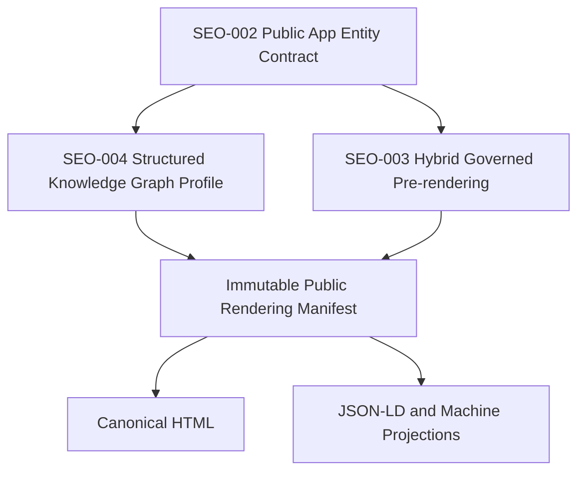
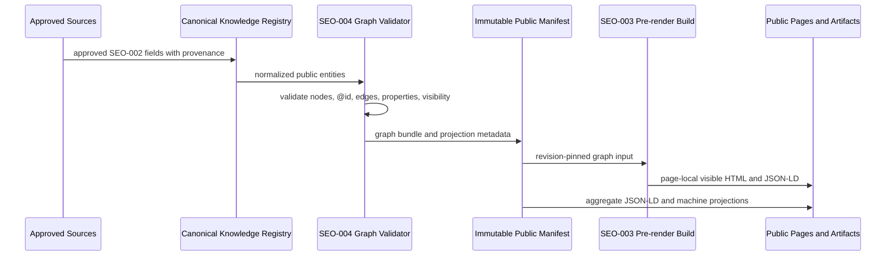

# Ansiversa Structured Knowledge Graph Profile

**Profile:** AI SEO Structured Knowledge Graph
**Profile Version:** Proposed V1
**Task:** SEO-004
**Status:** Proposed
**Discovery:** Complete
**Specification:** Complete
**Architecture Review:** Pending Astra Review
**Product Owner Approval:** Pending
**ADR:** Proposed
**Implementation:** Not authorized
**Production:** Unchanged
**Created:** 2026-07-23
**Primary Standards Reviewed:** Google Search Central and Schema.org, reviewed
2026-07-23

This profile defines the governed public graph Ansiversa may project from the
Canonical AI Knowledge Registry. It is an implementation-ready specification,
not implementation authorization.

---

# Governing Laws

## AI SEO Engineering Law #1

> Every public claim must have exactly one approved source of truth.

## AI SEO Engineering Law #2

> Every published artifact must be reproducible from one immutable approved
> revision.

SEO-004 applies these laws to graph nodes, graph edges, schema.org properties,
page-local JSON-LD, public graph exports, and future pre-render manifests.

---

# Why SEO-004 Is Separate From SEO-003

SEO-003 selected the rendering mechanism: only approved public routes are
pre-rendered from one immutable backend compiler artifact, while private
workflows stay client-rendered.

SEO-004 defines the structured graph that rendering may embed and publish.
Without SEO-004, a pre-rendered page could still expose weak or inconsistent
JSON-LD. Without SEO-003, a correct graph could still fail page-level
human/machine parity because SPA initial HTML does not contain the matching
visible content.

The two decisions are paired but independent:

---

# Profile Boundary

The graph represents only approved public product knowledge:

- the Ansiversa platform;
- public platform pages;
- the fixed public app collection;
- exactly 100 current solution apps;
- approved public categories;
- approved public app relationships;
- approved public FAQs.

The graph must not represent:

- authenticated workflows;
- user records;
- internal IDs or database IDs;
- test users;
- private production artifacts;
- implementation internals;
- future roadmap claims as current facts;
- ratings, aggregate ratings, reviews, prices, offers, coupons, guarantees,
  medical/legal/financial advice claims, or unsupported AI capabilities.

---

# Supported Entity Types

| Entity | Canonical schema.org type | Required? | Owner |
|---|---|---:|---|
| Platform organization | `Organization` | Yes | Platform |
| Platform website | `WebSite` | Yes | Platform |
| Public page | `WebPage` or specific subtype | Yes for allowlisted public pages | Platform |
| Apps catalog page | `CollectionPage` | Yes | Platform |
| Category collection | `CollectionPage` | Yes when category pages become public canonical pages | Platform |
| Solution app | `SoftwareApplication` | Yes for all 100 apps | Platform identity plus app-owned content |
| FAQ page | `FAQPage` | Conditional | Platform/app communication approval |
| FAQ item | `Question` + `Answer` | Conditional | Approved FAQ source |
| Audience | `Audience` | Optional | SEO-002 content authority |
| Breadcrumbs | `BreadcrumbList` | Deferred to SEO-006 | Platform routing |

V1 may publish category membership through `CollectionPage.hasPart` before
category pages are pre-rendered. Public category route decisions remain outside
SEO-004.

---

# Stable ID Rules

Every graph node must use deterministic canonical `@id` values derived from
approved canonical URLs and bounded fragments:

| Node | `@id` pattern |
|---|---|
| Organization | `https://ansiversa.com/#organization` |
| WebSite | `https://ansiversa.com/#website` |
| Apps collection | `https://ansiversa.com/apps#collection` |
| Public page | `{canonicalUrl}#webpage` |
| Category collection | `https://ansiversa.com/apps/{categorySlug}#collection` or another SEO-006-approved canonical category URL |
| App software | `https://ansiversa.com/{appSlug}#software` |
| App page | `https://ansiversa.com/{appSlug}#webpage` |
| App FAQ page | `https://ansiversa.com/{appSlug}#faq` |
| FAQ question | `{faqPageId}/q/{stableQuestionId}` |
| Audience | `{entityId}/audience/{stableAudienceId}` |

Rules:

- `@id` stability follows permanent app identity, not marketing text.
- `@id` fragments must not contain database primary keys or private source
  paths.
- Replacing an app requires a governed identity decision from SEO-002; the new
  app receives a new graph identity.
- Retired identities and redirects are deferred until retirement architecture
  is approved.
- The same entity must keep the same `@id` in page-local JSON-LD and aggregate
  public graph exports.

---

# Required Graph Shape

## Platform Bundle

The platform bundle contains:

- `Organization`;
- `WebSite`;
- public platform `WebPage` nodes;
- Apps `CollectionPage`;
- optional platform `FAQPage`.

Required links:

- `WebSite.publisher -> Organization`;
- `WebPage.isPartOf -> WebSite`;
- `CollectionPage.isPartOf -> WebSite`;
- Apps `CollectionPage.hasPart -> SoftwareApplication[]`.

## App Bundle

Every public app page bundle contains:

- app `WebPage`;
- app `SoftwareApplication`;
- optional app `FAQPage`;
- optional approved `Audience` nodes.

Required links:

- `WebPage.isPartOf -> WebSite`;
- `WebPage.mainEntity -> SoftwareApplication`;
- `SoftwareApplication.isPartOf -> Apps CollectionPage`;
- `SoftwareApplication.url -> canonical app URL`;
- `SoftwareApplication.applicationSuite -> Ansiversa`;
- `SoftwareApplication.publisher -> Organization`;
- `SoftwareApplication.audience -> Audience[]` when audiences are exposed;
- `FAQPage.mainEntity -> Question[]` only when the visible page shows the same
  approved FAQs.

## Category Bundle

Category collections are governed as collections of public apps. V1 may expose
them in aggregate graph output. Page-local category graph output waits for
approved category pages.

Required links when published:

- `CollectionPage.isPartOf -> WebSite`;
- `CollectionPage.hasPart -> SoftwareApplication[]`;
- each app target exists in the same immutable graph release.

---

# Field Mapping

| SEO-002 field | Graph property | Notes |
|---|---|---|
| `identity.name` | `name` | Required on `SoftwareApplication` |
| `identity.canonicalUrl` | `url` and `@id` base | Required |
| `identity.overviewRoute` | page canonical URL | Required |
| `classification.categoryName` | `applicationCategory` | Required |
| `classification.platformId` | `applicationSuite`, `isPartOf`, `publisher` | Derived |
| `content.shortDescription` | `description` | Required |
| `content.purpose` | `abstract` or page visible text source | Optional in JSON-LD until validated against visible page |
| `content.intendedAudiences` | `audience` | Optional; each item needs provenance |
| `content.currentCapabilities` | `featureList` | Optional; publish only when visible on page |
| `content.workflowSteps` | visible page text only | Do not map to `HowTo` in V1 |
| `content.limitations` | visible text and possible `description` qualifier | Must be visible; no unsupported schema workaround |
| `content.safetyNotes` | visible text | Must not imply professional advice |
| `relationships.relatedApps` | `isRelatedTo` or collection links | Must use approved relation vocabulary |
| `discovery.aliases` | `alternateName` or `keywords` | Optional, bounded, no keyword stuffing |
| `governance.reviewedAt` | omitted from public V1 | Governance-only unless later approved |

Properties may be omitted when visible parity is not yet proven. Omission is
preferred over publishing unsupported or hidden claims.

---

# Prohibited Graph Properties In V1

The V1 public graph must not emit these properties unless a later approved
profile revision authorizes them with evidence and source authority:

- `aggregateRating`;
- `review`;
- `offers`;
- `price`;
- `priceCurrency`;
- `isAccessibleForFree`;
- `potentialAction` for authenticated workflows;
- `downloadUrl`;
- `installUrl`;
- `softwareRequirements` beyond generic web access;
- `permissions`;
- `screenshot`;
- `image` unless the image is approved, crawlable, indexable, and visibly
  relevant;
- medical, legal, financial, or safety advice schema beyond product identity;
- app implementation internals such as backend, database, migration, API,
  generated contract, authenticated, owner-scoped, Zustand, or React Router.

---

# Relationship Vocabulary

SEO-004 freezes graph-safe relationship codes as a projection of SEO-002, not
as a recommender system.

| Relationship | Direction | Public graph mapping | Authority |
|---|---|---|---|
| `same_category` | symmetric | collection membership | Derived from category |
| `complementary` | directed or symmetric | `isRelatedTo` | Approved relationship |
| `next_workflow` | directed | `isRelatedTo` with public reason in machine export; JSON-LD only if visible | Approved relationship |
| `input_to` | directed | `isRelatedTo`; JSON-LD reason omitted unless visible | Approved relationship |
| `output_from` | directed | `isRelatedTo`; JSON-LD reason omitted unless visible | Approved relationship |
| `alternative_scope` | symmetric | `isRelatedTo` | Approved relationship |

Rules:

- Relationship targets must exist in the same 100-app catalog release.
- Relationship text must not imply ranking, popularity, personalization, or
  user-specific recommendation.
- Derived same-category relationships may be emitted as collection membership.
- Semantic relationships require explicit approval for both source and target
  implications.
- A missing optional relationship is omitted, not generated by AI similarity.

---

# Request And Build Lifecycle

SEO-004 participates in a later implementation lifecycle as follows:

Timing:

- build time: registry normalization, graph validation, manifest creation,
  page-local graph bundles, aggregate graph export;
- deployment time: artifact/HTML revision pairing and rollback eligibility;
- request time: serve immutable approved output and public cache headers;
- asynchronous: future observation from SEO-007 only, never source truth.

---

# Repository Ownership

| Responsibility | Repository |
|---|---|
| Canonical knowledge compilation | `ansiversa-api` |
| Graph profile validation | `ansiversa-api` |
| Public manifest production | `ansiversa-api` |
| Public machine projection generation | `ansiversa-api` |
| Public pre-render route consumption | `ansiversa` after SEO-003 implementation approval |
| Page-local JSON-LD embedding | `ansiversa` from backend manifest only |
| Route authority | `ansiversa` route registry, validated by backend compiler |
| App lifecycle documents | `ansiversa-api/app/modules/<app_module>/` |
| Runtime private workflow data | app modules; excluded from public graph |

The frontend must not parse `story.md`, `destination.md`, `market-study.md`, or
`marketing.md`. It receives only a validated public manifest.

---

# Cache, Invalidation, And Rollback

- Graph output belongs to the immutable public release pair defined by SEO-003.
- Mutable `latest` graph fetches are not valid build inputs.
- A graph release is identified by registry schema version, profile version,
  source revision, entity revisions, generated artifact digest, and route set.
- A profile validation failure emits no new graph release.
- If an optional non-critical graph property fails, it may be omitted only when
  the approved deployment policy says omission is safe.
- Critical failures block the whole public release: identity conflict, route
  conflict, private content, unsupported current claim, missing required node,
  broken `@id`, broken edge, fixed-catalog count failure, and structured data
  that is not visible on the canonical page.
- Rollback restores the previous immutable HTML and graph artifact pair.

---

# Security And Privacy

The graph is public by default-deny allowlist. Validation must scan every graph
node and edge for:

- credentials, tokens, cookies, database URLs, and private keys;
- internal source paths and governance-only provenance;
- authenticated/user-specific content;
- raw Markdown;
- internal implementation vocabulary;
- unsupported professional advice;
- future roadmap language in current fields;
- competitor-copy and keyword-stuffing patterns.

Public graph output may expose approved product truth only. It may not expose
approver names, internal review notes, content hashes, source paths, or private
production artifacts.

---

# Observability

SEO-004 implementation evidence should be deterministic first:

- graph node counts by type;
- exactly 100 `SoftwareApplication` nodes;
- category membership count;
- orphan node and broken edge count;
- unknown property count;
- prohibited property count;
- visible-parity failures;
- JSON-LD syntax validity;
- Schema.org context validity;
- Google Rich Results Test or URL Inspection evidence for representative pages
  after deployment approval;
- public graph digest and previous-release diff.

Provider observations belong to SEO-007 and must not be treated as source
truth.

---

# Partial Failure Rules

| Failure | Behavior |
|---|---|
| One app has missing required identity/category/route | Block release |
| One app has stale required capability/limitation/safety truth | Block release for safety/current truth |
| Optional alias invalid | Omit alias and report |
| Optional relationship invalid | Omit relationship and report unless it breaks category integrity |
| Graph `@id` collision | Block release |
| Broken relationship target | Block release |
| Prohibited property present | Block release |
| JSON-LD syntactically invalid | Block release |
| Page-local JSON-LD differs from visible page | Block release |
| Aggregate graph differs from page-local entity revision | Block release |
| External validator unavailable | Do not block deterministic build; record as review evidence gap |

---

# Validation Criteria For Later Implementation

A later implementation task must prove:

- graph profile version is explicit;
- all emitted nodes match the approved type allowlist;
- all `@id` values follow the stable ID rules;
- every `SoftwareApplication` maps to one of exactly 100 public apps;
- no App #101 is introduced;
- all edges resolve within the same graph release;
- every public property has SEO-002 provenance;
- no prohibited properties are emitted;
- page-local graph data matches visible pre-rendered content;
- aggregate graph and page-local graph share the same revision;
- generated graph output is deterministic;
- failure behavior is covered by tests;
- rollback restores the prior graph and HTML pair;
- Google and Schema.org validation evidence is collected only after deployment
  approval; and
- production behavior remains unchanged until separate implementation approval.

---

# Standards Notes

Google Search Central states that JSON-LD is a recommended structured-data
format, that structured data must represent visible page content, and that
valid markup does not guarantee rich results. The profile therefore treats
structured data as an accuracy and eligibility layer, not as a ranking or AI
answer guarantee.

Schema.org provides the vocabulary. Ansiversa uses a narrow supported subset so
the graph remains governed, reproducible, and aligned with visible product
truth.

Reviewed sources:

- https://developers.google.com/search/docs/appearance/structured-data/sd-policies
- https://developers.google.com/search/docs/appearance/structured-data/intro-structured-data
- https://developers.google.com/search/docs/appearance/structured-data/software-app
- https://schema.org/SoftwareApplication
- https://schema.org/Organization
- https://schema.org/FAQPage

---

# Open Questions For Astra And Product Owner

1. Should category collection nodes be emitted before category pages are
   canonical public pages, or should they remain aggregate-only until SEO-006?
2. Should `featureList` be used for current capabilities once page-visible
   parity exists, or should capabilities remain visible text only in V1?
3. Should app-level FAQs be included in page-local JSON-LD only, aggregate
   graph only, or both after visible FAQ sections exist?
4. Should `SoftwareApplication.applicationCategory` use Ansiversa category
   labels only, or map to a smaller public taxonomy later?
5. Should public graph output include non-sensitive reviewed dates after a
   later governance/public freshness decision?
